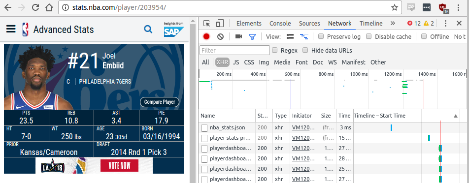

# Scraping Tutorial

One of the first things that all data scientists need to learn is proper scraping and data collection techniques. In this breif tutorial, you will learn how to scrap data efficiently at a beginners level, read back end API's with little documentation, and storing data in a database.

### Using Developer Tools for Secret API's

Using the developer tools option on your browser (chrome or firefox), you can research the javascript calls to the website to see if there is any calls you can replicate in your code. By finding an API this way, you can eliminate the need to do any scraping.

#### Steps

1. Navigate to the [website](http://stats.nba.com/player/203954/) you wish to use as your external API. **Note: this does not work for all websites and you will see why in the next section on scraping.**

2. Open the developer tools on your browser. You should see a window similar to below.

3. Select `Network > XHR`. You will see several json responses for different external API calls to the website. You can click one of the responses you want to inspect and you will see a window like below. You can explore the data in the Preview tab and find the exact URL in the Headers tab. You can see a raw json response with the [URL](http://stats.nba.com/stats/playerdashboardbyyearoveryear?DateFrom=&DateTo=&GameSegment=&LastNGames=0&LeagueID=00&Location=&MeasureType=Base&Month=0&OpponentTeamID=0&Outcome=&PORound=0&PaceAdjust=N&PerMode=PerGame&Period=0&PlayerID=203954&PlusMinus=N&Rank=N&Season=2017-18&SeasonSegment=&SeasonType=Regular+Season&ShotClockRange=&Split=yoy&VsConference=&VsDivision=) presented in the Headers tab.

4. For the next step, we are going to be programming the calls in python. The jupyter notebook we use is [here](api.pynb).
